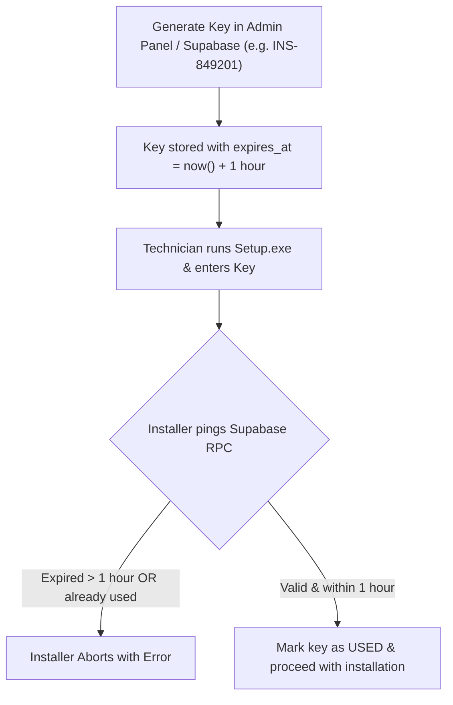
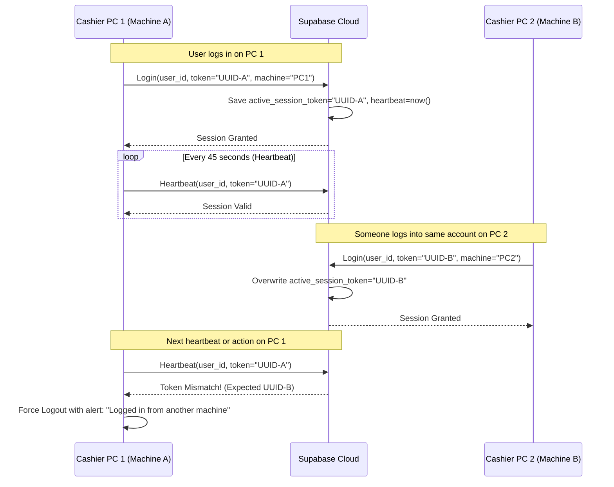

# Retail Sathi: Installer Activation & Session Concurrency Plan

This document outlines the complete architectural design, database schemas, RPC functions, and implementation steps for:
1. **1-Hour Disposable Installer Activation Keys (Pre-Installation)**
2. **Single-Device Concurrent Session Control (Preventing simultaneous user logins)**

---

## 1. 1-Hour Disposable Installer Activation Keys

### Overview
Before the installer extracts files or installs the application onto a client machine, it requests an activation code (e.g., `INS-849201`). The key remains active for exactly **1 hour** after generation and can only be used once.



### Supabase Database Schema

Run this SQL query in your **Supabase SQL Editor**:

```sql
-- 1. Create installer_keys table
CREATE TABLE IF NOT EXISTS installer_keys (
    id BIGINT GENERATED BY DEFAULT AS IDENTITY PRIMARY KEY,
    key_code TEXT UNIQUE NOT NULL,               -- e.g. "INS-849201"
    store_id BIGINT REFERENCES stores(id) ON DELETE CASCADE,
    client_name TEXT,
    expires_at TIMESTAMPTZ NOT NULL,            -- now() + interval '1 hour'
    used_at TIMESTAMPTZ,                        -- NULL until successfully activated
    used_on_machine TEXT,                       -- Hardware GUID / Device Identifier
    created_at TIMESTAMPTZ DEFAULT timezone('utc'::text, now()) NOT NULL
);

-- 2. Index for fast lookup
CREATE INDEX IF NOT EXISTS idx_installer_key_code ON installer_keys(key_code);

-- 3. Atomic RPC function to validate and redeem the key
CREATE OR REPLACE FUNCTION validate_installer_key(
    p_key_code TEXT,
    p_machine_guid TEXT DEFAULT 'Unknown'
)
RETURNS JSONB
LANGUAGE plpgsql
SECURITY DEFINER
AS $$
DECLARE
    v_key RECORD;
BEGIN
    -- Look up the key (case-insensitive)
    SELECT * INTO v_key 
    FROM installer_keys 
    WHERE UPPER(TRIM(key_code)) = UPPER(TRIM(p_key_code));

    IF NOT FOUND THEN
        RETURN jsonb_build_object('valid', false, 'error', 'Invalid activation code.');
    END IF;

    -- Check if already used
    IF v_key.used_at IS NOT NULL THEN
        RETURN jsonb_build_object('valid', false, 'error', 'This activation code has already been used.');
    END IF;

    -- Check if expired (> 1 hour)
    IF v_key.expires_at < timezone('utc'::text, now()) THEN
        RETURN jsonb_build_object('valid', false, 'error', 'This activation code expired after 1 hour.');
    END IF;

    -- Mark as used atomically
    UPDATE installer_keys 
    SET used_at = timezone('utc'::text, now()),
        used_on_machine = p_machine_guid
    WHERE id = v_key.id;

    RETURN jsonb_build_object(
        'valid', true, 
        'store_id', v_key.store_id,
        'message', 'Activation verified successfully.'
    );
END;
$$;
```

### Key Generation Helper (SQL)

To generate a new 1-hour activation key on demand:

```sql
-- Generate a 6-digit activation key valid for 1 hour
INSERT INTO installer_keys (key_code, store_id, client_name, expires_at)
VALUES (
    'INS-' || LPAD(FLOOR(RANDOM() * 900000 + 100000)::TEXT, 6, '0'),
    1, -- Target Store ID
    'Main Branch Client',
    timezone('utc'::text, now()) + INTERVAL '1 hour'
)
RETURNING key_code, expires_at;
```

---

## 2. NSIS Installer Configuration (Tauri Windows)

### 1. Update `src-tauri/tauri.conf.json`:
```json
"bundle": {
  "active": true,
  "targets": "all",
  "windows": {
    "nsis": {
      "installerHooks": "nsis/installer-license-hook.nsi"
    }
  }
}
```

### 2. Custom NSIS Script (`src-tauri/nsis/installer-license-hook.nsi`):
```nsis
!include "MUI2.nsh"
!include "nsDialogs.nsh"

Var LicenseDialog
Var LicenseInput
Var LicenseKey

Page custom LicenseKeyPageCreate LicenseKeyPageLeave

Function LicenseKeyPageCreate
    !insertmacro MUI_HEADER_TEXT "Installation Activation" "Enter your 1-hour Retail Sathi activation key to proceed."
    nsDialogs::Create 1018
    Pop $LicenseDialog
    
    ${NSD_CreateLabel} 0 0 100% 24u "Please enter the activation key provided by Retail Sathi support:"
    Pop $0
    
    ${NSD_CreateText} 0 30u 100% 14u ""
    Pop $LicenseInput
    
    nsDialogs::Show
FunctionEnd

Function LicenseKeyPageLeave
    ${NSD_GetText} $LicenseInput $LicenseKey
    ${If} $LicenseKey == ""
        MessageBox MB_ICONSTOP "Activation Key cannot be empty."
        Abort
    ${EndIf}
    
    ; Perform verification via Supabase REST RPC endpoint
    ; If valid, store the store_id / token in Registry or AppData
    WriteRegStr HKCU "Software\RetailSathi" "InstallerActivationKey" $LicenseKey
FunctionEnd
```

---

## 3. Single-Device Concurrent Session Control

### Overview
Ensures that a single user account (e.g. `cashier1` or `admin`) cannot be used concurrently on multiple machines at the same time.



### Database Schema Migration

Run this SQL query in your **Supabase SQL Editor**:

```sql
-- Add session tracking columns to users table
ALTER TABLE users 
ADD COLUMN IF NOT EXISTS active_session_token TEXT,
ADD COLUMN IF NOT EXISTS active_machine_id TEXT,
ADD COLUMN IF NOT EXISTS active_machine_name TEXT,
ADD COLUMN IF NOT EXISTS last_heartbeat TIMESTAMPTZ;
```

---

### Implementation Architecture

#### 1. Login Procedure (`src/features/auth/services/authService.ts`)
When a user logs in:
1. Generate a unique session token: `const sessionToken = crypto.randomUUID()`.
2. Retrieve the machine hardware identifier.
3. Update Supabase with `active_session_token`, `active_machine_id`, and `last_heartbeat = new Date().toISOString()`.
4. Store `sessionToken` inside the local session (`localStorage`).

#### 2. Heartbeat & Concurrency Check (`src/services/syncProcessor.ts`)
Every **45 seconds** (or during sync checks):
1. Query Supabase for the current user's `active_session_token`.
2. If `cloudSessionToken !== localSessionToken`:
   - Another device took over the session.
   - Immediately call `clearStoredSession()`.
   - Alert the user: *"You have been logged out because this account was accessed on another machine."*
   - Redirect to `/login`.

#### 3. Handling Idle / Inactive Machine Timeouts
If a machine crashes or is abruptly turned off without logging out:
- If `now() - last_heartbeat > 3 minutes`, the cloud session is treated as idle/expired, allowing a new login on any machine without being permanently blocked.

---

## 4. Implementation Checklist

- [ ] Execute `installer_keys` and `users` session columns SQL on Supabase.
- [ ] Add `validate_installer_key` RPC function on Supabase.
- [ ] Implement `active_session_token` generation on login in `authService.ts`.
- [ ] Add background session heartbeat check in `syncProcessor.ts`.
- [ ] Configure NSIS hook in `src-tauri/tauri.conf.json` and create `src-tauri/nsis/installer-license-hook.nsi`.
