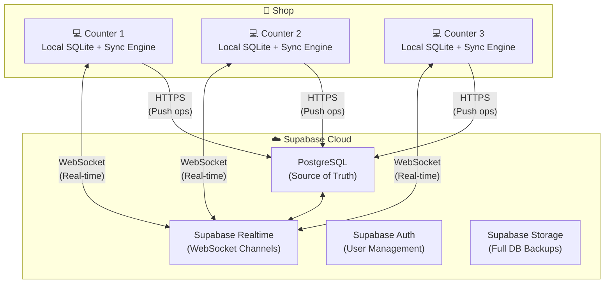
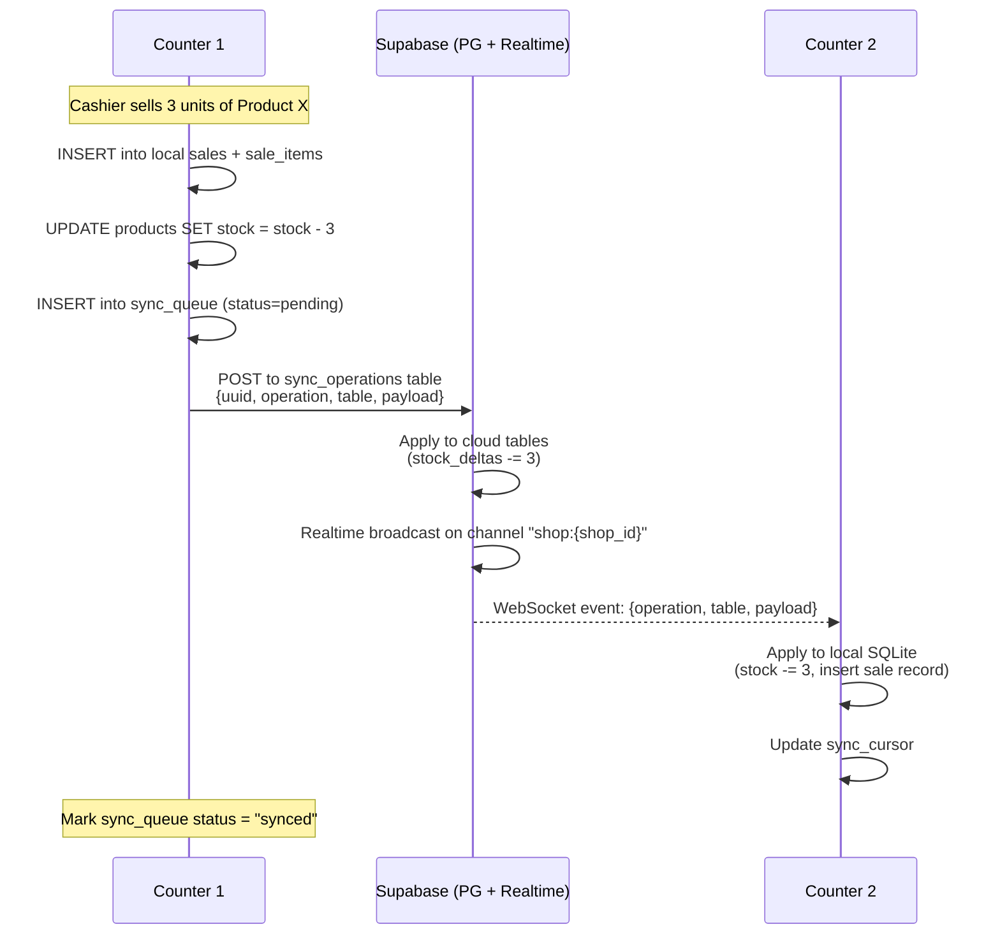
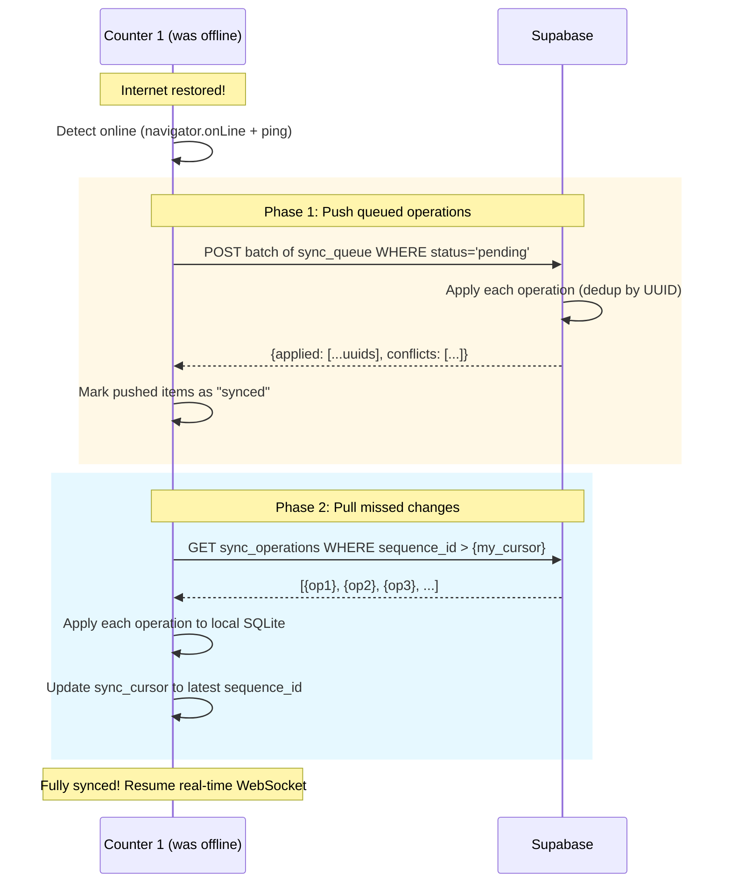
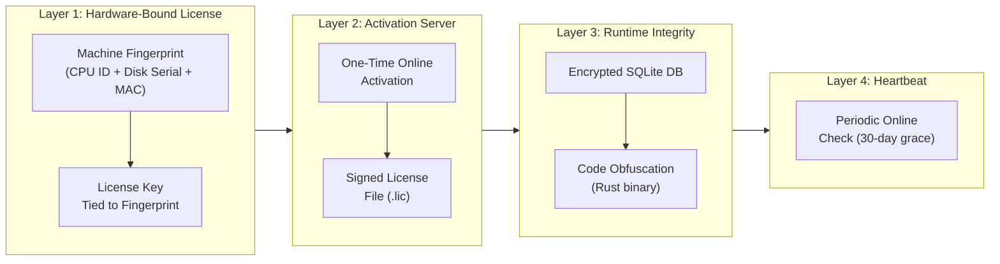
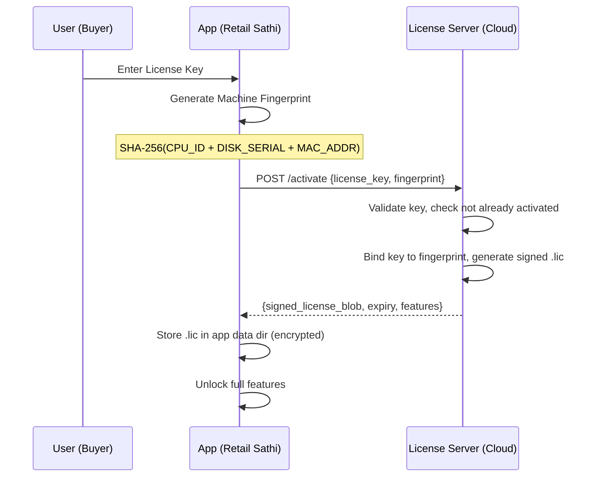

# Retail Sathi v3 — Implementation Plan
# Multi-Counter Cloud Sync, Role-Based Auth, Anti-Piracy & Cloud Backup

> **Created:** 13 Sep 2026
> **Status:** Approved — Ready for Implementation

---

## Current Architecture Snapshot

| Layer | Technology |
|---|---|
| Desktop Framework | **Tauri v2** (Rust backend + WebView frontend) |
| Frontend | **React 19** + React Router 7 + TypeScript 6 + Vite 8 |
| Database | **SQLite** via `@tauri-apps/plugin-sql` — 8 tables, raw SQL, no ORM |
| Auth | **None** — zero login, users, roles, or tokens |
| Networking | **None** — 100% offline, no HTTP clients, no sync |
| Anti-Piracy | **None** — no license checks, activation, or fingerprinting |

---

# Part 1: Cloud-First Real-Time Multi-Counter Sync

## Why Cloud-First

| Concern | Solution |
|---|---|
| Owner must run a "server" PC | No server concept — just install and connect |
| Counters must be on same WiFi/LAN | Works across locations, cities, anywhere with internet |
| Server goes down = sync stops | Supabase is managed, 99.9% uptime |
| Complex setup for non-technical shopkeepers | Enter shop code + login = done |
| Backup is a separate system | Cloud IS the backup — every operation is stored |

## Architecture: Cloud-Centric Real-Time Sync



### How It Works (30-Second Summary)

1. Counter makes a sale → writes to **local SQLite** immediately (instant UI)
2. Sync Engine pushes the operation to **Supabase PostgreSQL** via HTTPS
3. Supabase Realtime **broadcasts** the change to all other counters via WebSocket
4. Other counters receive the broadcast → apply to their local SQLite → UI updates
5. If a counter is **offline**, operations queue locally → auto-push on reconnect
6. Cloud PostgreSQL is always the **source of truth** for resolving conflicts

---

## The Sync Engine

### Core Concept: Operation Log, Not Row Sync

We don't sync entire table rows (causes merge nightmares). Instead, every mutation is recorded as an **operation** with a delta, pushed to cloud, and replayed on other counters.

### Local Tables (Added to Each Counter's SQLite)

```sql
-- Queue of operations waiting to be pushed to cloud
CREATE TABLE sync_queue (
    id INTEGER PRIMARY KEY AUTOINCREMENT,
    uuid TEXT UNIQUE NOT NULL,            -- UUID v4 (globally unique)
    counter_id TEXT NOT NULL,             -- "counter-1", "counter-2"
    user_id INTEGER,                      -- who did this
    operation TEXT NOT NULL,              -- "INSERT", "UPDATE", "DELETE"
    table_name TEXT NOT NULL,             -- "sales", "products", etc.
    record_id INTEGER,                    -- local PK of affected row
    record_uuid TEXT,                     -- cloud UUID of the record
    payload TEXT NOT NULL,               -- JSON: full row data or delta
    created_at TEXT NOT NULL,            -- ISO 8601 with ms precision
    status TEXT DEFAULT 'pending'        -- "pending" | "synced" | "failed"
);

-- Track what we've already received from cloud
CREATE TABLE sync_cursor (
    id INTEGER PRIMARY KEY CHECK (id = 1),  -- singleton row
    last_sequence_id BIGINT DEFAULT 0,       -- cloud sequence we've seen
    last_synced_at TEXT
);

-- Map local SQLite IDs to cloud UUIDs
CREATE TABLE id_map (
    table_name TEXT NOT NULL,
    local_id INTEGER NOT NULL,
    cloud_uuid TEXT NOT NULL,
    PRIMARY KEY (table_name, local_id)
);
```

### Sync Flow: Real-Time



### Sync Flow: Offline → Reconnect



---

## Stock Management: The Hard Problem

> **⚠️ CAUTION:** Stock is the most dangerous thing to sync. If Counter-1 and Counter-2 both sell the last 2 units simultaneously, you've oversold. We solve this with **delta-based tracking**.

### Delta-Based Stock (Not Absolute Values)

Instead of syncing `stock = 47` (which can conflict), we sync **deltas**: "Counter-1 sold 3 units" and "Counter-2 sold 2 units."

```
Cloud computes true stock:
  base_stock (from purchases/inventory) = 50
  - Counter-1 sold 3
  - Counter-2 sold 5
  = 42 units remaining
```

#### Cloud Table: `stock_deltas`

```sql
CREATE TABLE stock_deltas (
    id BIGSERIAL PRIMARY KEY,
    shop_id UUID NOT NULL REFERENCES shops(id),
    product_uuid UUID NOT NULL,
    counter_id TEXT NOT NULL,
    delta INTEGER NOT NULL,           -- negative = sold/removed, positive = added/restocked
    reason TEXT NOT NULL,             -- 'sale', 'purchase', 'adjustment', 'sale_edit', 'sale_delete'
    reference_uuid TEXT,              -- UUID of the sale/purchase that caused this
    created_at TIMESTAMPTZ DEFAULT now()
);

-- Function to get current stock for a product
CREATE OR REPLACE FUNCTION get_product_stock(p_product_uuid UUID, p_shop_id UUID)
RETURNS INTEGER AS $$
    SELECT COALESCE(SUM(delta), 0)::INTEGER
    FROM stock_deltas
    WHERE product_uuid = p_product_uuid AND shop_id = p_shop_id;
$$ LANGUAGE sql STABLE;
```

#### Oversell Prevention

```sql
-- Atomic stock check + reserve (PostgreSQL function)
CREATE OR REPLACE FUNCTION try_reserve_stock(
    p_shop_id UUID,
    p_product_uuid UUID,
    p_counter_id TEXT,
    p_quantity INTEGER,
    p_reference_uuid TEXT
) RETURNS BOOLEAN AS $$
DECLARE
    current_stock INTEGER;
BEGIN
    -- Lock the product's deltas to prevent concurrent reads
    PERFORM 1 FROM stock_deltas
        WHERE product_uuid = p_product_uuid AND shop_id = p_shop_id
        FOR UPDATE;

    SELECT COALESCE(SUM(delta), 0) INTO current_stock
        FROM stock_deltas
        WHERE product_uuid = p_product_uuid AND shop_id = p_shop_id;

    IF current_stock < p_quantity THEN
        RETURN FALSE;  -- Not enough stock
    END IF;

    INSERT INTO stock_deltas (shop_id, product_uuid, counter_id, delta, reason, reference_uuid)
    VALUES (p_shop_id, p_product_uuid, p_counter_id, -p_quantity, 'sale', p_reference_uuid);

    RETURN TRUE;
END;
$$ LANGUAGE plpgsql;
```

#### Local Optimistic Stock

Each counter tracks stock **optimistically** in local SQLite (deduct immediately for instant UX). If the cloud rejects the sale (oversold), the counter shows an error and reverts the local sale.

```
Local stock = cloud_stock_snapshot - my_pending_local_sales
```

---

## Conflict Resolution

| Scenario | Resolution |
|---|---|
| **Two counters sell same product** | Delta-based — both deltas are valid, cloud sums them. `try_reserve_stock()` prevents overselling |
| **Same invoice number** | Impossible — invoice includes counter ID: `INV-C1-...`, `INV-C2-...` |
| **Product price edited on two counters** | Last-write-wins by `created_at` timestamp |
| **Sale edited on C1, deleted on C2** | Delete wins (tombstone). Edit op finds no record, becomes a no-op |
| **Customer details edited on two counters** | Last-write-wins. Non-destructive: phone from C1, address from C2 → merge fields |
| **Duplicate operation (network retry)** | UUID-based dedup — cloud ignores ops with already-seen UUIDs |
| **Counter was offline for days** | On reconnect: push local queue → pull all missed ops in sequence → rebuild local state |

---

## Cloud Database Schema (Supabase PostgreSQL)

```sql
-- ============================================
-- TENANT / SHOP
-- ============================================
CREATE TABLE shops (
    id UUID PRIMARY KEY DEFAULT gen_random_uuid(),
    license_key TEXT UNIQUE NOT NULL,
    shop_name TEXT NOT NULL,
    owner_name TEXT,
    owner_phone TEXT,
    plan TEXT DEFAULT 'starter',          -- starter, professional, enterprise
    max_counters INTEGER DEFAULT 1,
    is_active BOOLEAN DEFAULT true,
    activated_at TIMESTAMPTZ,
    expires_at TIMESTAMPTZ,
    created_at TIMESTAMPTZ DEFAULT now()
);

CREATE TABLE counters (
    id UUID PRIMARY KEY DEFAULT gen_random_uuid(),
    shop_id UUID NOT NULL REFERENCES shops(id),
    counter_id TEXT NOT NULL,              -- "counter-1", human-readable
    machine_fingerprint TEXT,
    last_seen_at TIMESTAMPTZ,
    is_active BOOLEAN DEFAULT true,
    created_at TIMESTAMPTZ DEFAULT now(),
    UNIQUE(shop_id, counter_id)
);

-- ============================================
-- SYNC OPERATIONS LOG (append-only)
-- ============================================
CREATE TABLE sync_operations (
    id BIGSERIAL PRIMARY KEY,              -- sequential, used as cursor
    shop_id UUID NOT NULL REFERENCES shops(id),
    uuid TEXT UNIQUE NOT NULL,             -- client-generated UUID
    counter_id TEXT NOT NULL,
    user_id INTEGER,
    operation TEXT NOT NULL,               -- INSERT, UPDATE, DELETE
    table_name TEXT NOT NULL,
    record_uuid TEXT NOT NULL,             -- cloud UUID of affected record
    payload JSONB NOT NULL,                -- full row or delta
    created_at TIMESTAMPTZ DEFAULT now()
);

-- Index for pull queries (counter fetching ops since last cursor)
CREATE INDEX idx_sync_ops_shop_seq ON sync_operations(shop_id, id);

-- ============================================
-- CLOUD MIRROR TABLES
-- ============================================
CREATE TABLE products_cloud (
    uuid UUID PRIMARY KEY DEFAULT gen_random_uuid(),
    shop_id UUID NOT NULL REFERENCES shops(id),
    barcode TEXT,
    name TEXT NOT NULL,
    batch_no TEXT,
    mrp REAL,
    price REAL NOT NULL,
    cost_price REAL,
    hsn_code TEXT,
    reorder_threshold INTEGER DEFAULT 10,
    gst_rate REAL DEFAULT 0,
    category TEXT DEFAULT 'General',
    is_deleted BOOLEAN DEFAULT false,      -- soft delete for sync
    created_at TIMESTAMPTZ DEFAULT now(),
    updated_at TIMESTAMPTZ DEFAULT now()
);
-- Stock is NOT stored here — computed from stock_deltas

CREATE TABLE sales_cloud (
    uuid UUID PRIMARY KEY DEFAULT gen_random_uuid(),
    shop_id UUID NOT NULL REFERENCES shops(id),
    counter_id TEXT NOT NULL,
    invoice_no TEXT NOT NULL,
    customer_name TEXT,
    customer_phone TEXT,
    total_amount REAL NOT NULL,
    discount REAL DEFAULT 0,
    tax_amount REAL DEFAULT 0,
    grand_total REAL NOT NULL,
    payment_mode TEXT NOT NULL,
    marketing_person_uuid UUID,
    is_deleted BOOLEAN DEFAULT false,
    created_at TIMESTAMPTZ DEFAULT now(),
    updated_at TIMESTAMPTZ DEFAULT now(),
    UNIQUE(shop_id, invoice_no)
);

CREATE TABLE sale_items_cloud (
    uuid UUID PRIMARY KEY DEFAULT gen_random_uuid(),
    sale_uuid UUID NOT NULL REFERENCES sales_cloud(uuid) ON DELETE CASCADE,
    product_uuid UUID REFERENCES products_cloud(uuid),
    product_name TEXT NOT NULL,
    barcode TEXT,
    price REAL NOT NULL,
    quantity INTEGER NOT NULL,
    total_price REAL NOT NULL
);

CREATE TABLE customers_cloud (
    uuid UUID PRIMARY KEY DEFAULT gen_random_uuid(),
    shop_id UUID NOT NULL REFERENCES shops(id),
    name TEXT NOT NULL,
    phone TEXT,
    address TEXT,
    loyalty_points REAL DEFAULT 0,
    dues REAL DEFAULT 0,
    is_deleted BOOLEAN DEFAULT false,
    created_at TIMESTAMPTZ DEFAULT now(),
    updated_at TIMESTAMPTZ DEFAULT now()
);

-- stock_deltas table defined above in Stock Management section

-- ============================================
-- ROW-LEVEL SECURITY (tenant isolation)
-- ============================================
ALTER TABLE sync_operations ENABLE ROW LEVEL SECURITY;
ALTER TABLE products_cloud ENABLE ROW LEVEL SECURITY;
ALTER TABLE sales_cloud ENABLE ROW LEVEL SECURITY;
ALTER TABLE stock_deltas ENABLE ROW LEVEL SECURITY;

-- Each counter can only read/write its own shop's data
CREATE POLICY shop_isolation ON sync_operations
    USING (shop_id = (current_setting('app.current_shop_id'))::UUID);

-- (Similar policies on all _cloud tables)
```

---

## Supabase Realtime Integration

### Channel Setup (TypeScript Client)

```typescript
// src/features/sync/services/realtimeClient.ts
import { createClient } from '@supabase/supabase-js';

const supabase = createClient(SUPABASE_URL, SUPABASE_ANON_KEY);

export function subscribeToShopChanges(
  shopId: string,
  onOperation: (op: SyncOperation) => void
) {
  const channel = supabase
    .channel(`shop:${shopId}`)
    .on(
      'postgres_changes',
      {
        event: 'INSERT',
        schema: 'public',
        table: 'sync_operations',
        filter: `shop_id=eq.${shopId}`,
      },
      (payload) => {
        const op = payload.new as SyncOperation;
        // Ignore our own operations (already applied locally)
        if (op.counter_id === MY_COUNTER_ID) return;
        onOperation(op);
      }
    )
    .subscribe();

  return channel;
}
```

### What Triggers Real-Time Updates

| Event on Any Counter | Broadcast to Other Counters | Local Effect |
|---|---|---|
| New sale created | "Sale created, stock reduced for items X, Y" | Insert sale record, reduce local stock |
| Sale edited | "Sale updated, stock adjusted for items" | Update sale, adjust stock |
| Sale deleted | "Sale deleted, stock restored for items" | Remove sale, restore stock |
| Product added/edited | "Product created/updated with new details" | Upsert product in local DB |
| Purchase recorded | "Purchase recorded, stock increased for items" | Insert purchase, increase stock |
| Customer created/edited | "Customer details changed" | Upsert customer |
| Due payment recorded | "Customer dues reduced by ₹X" | Update customer dues |

---

## Implementation: SyncEngine Class

```typescript
// src/features/sync/services/syncEngine.ts (simplified overview)

class SyncEngine {
  private shopId: string;
  private counterId: string;
  private isOnline: boolean = navigator.onLine;
  private channel: RealtimeChannel | null = null;

  // ─── PUSH: Local mutation → Cloud ───
  async pushOperation(op: {
    operation: 'INSERT' | 'UPDATE' | 'DELETE';
    tableName: string;
    recordUuid: string;
    payload: Record<string, any>;
  }) {
    const uuid = crypto.randomUUID();

    // 1. Queue locally (survives offline + crashes)
    await queueLocally(uuid, op);

    // 2. Try immediate push to cloud
    if (this.isOnline) {
      try {
        await pushToCloud(uuid, this.shopId, this.counterId, op);
        await markSynced(uuid);
      } catch (err) {
        // Will retry later — stays in queue
        console.warn('Push failed, queued for retry:', err);
      }
    }
  }

  // ─── PULL: Cloud change → Local DB ───
  async handleIncomingOperation(op: SyncOperation) {
    // Skip if we generated this operation
    if (op.counter_id === this.counterId) return;
    // Skip if already applied (UUID dedup)
    if (await isAlreadyApplied(op.uuid)) return;

    await applyToLocalDb(op);
    await updateCursor(op.id);
    // Emit event so React components re-fetch
    window.dispatchEvent(new CustomEvent('sync:update', { detail: op }));
  }

  // ─── RECONNECT: Catch up on missed changes ───
  async reconcile() {
    // Push all pending local operations
    const pending = await getPendingOps();
    for (const op of pending) {
      await pushToCloud(op);
      await markSynced(op.uuid);
    }
    // Pull all missed cloud operations
    const cursor = await getCursor();
    const missed = await fetchOpsSince(this.shopId, cursor);
    for (const op of missed) {
      await this.handleIncomingOperation(op);
    }
  }

  // ─── LIFECYCLE ───
  start() {
    this.channel = subscribeToShopChanges(this.shopId, (op) =>
      this.handleIncomingOperation(op)
    );
    window.addEventListener('online', () => { this.isOnline = true; this.reconcile(); });
    window.addEventListener('offline', () => { this.isOnline = false; });
  }

  stop() {
    this.channel?.unsubscribe();
  }
}
```

---

## Instrumenting Existing Services

Every existing service function (`createSale`, `updateProduct`, etc.) needs a one-line addition to log the operation for sync:

```typescript
// Before (billingService.ts → createSale):
await db.execute("INSERT INTO sales ...", [...]);

// After:
await db.execute("INSERT INTO sales ...", [...]);
await syncEngine.pushOperation({           // ← ADD THIS
  operation: 'INSERT',
  tableName: 'sales',
  recordUuid: saleUuid,
  payload: { ...saleData },
});
```

This is done by wrapping the database layer or adding a `withSync()` higher-order function:

```typescript
// Wrapper approach
export async function syncedExecute(
  db: Database, sql: string, params: any[],
  syncMeta: { operation: string; tableName: string; recordUuid: string; payload: any }
) {
  const result = await db.execute(sql, params);
  await syncEngine.pushOperation(syncMeta);
  return result;
}
```

---

## Backup: Now Built Into Sync

Since every operation flows through Supabase, **cloud backup is automatic**:

| What | How |
|---|---|
| **Continuous backup** | Every `sync_operations` row is an immutable audit log. Can replay to any point in time. |
| **Full DB snapshot** | Daily: compress local SQLite → encrypt → upload to Supabase Storage. For disaster recovery. |
| **Restore** | Download snapshot + replay `sync_operations` since snapshot timestamp = fully restored. |

The `sync_operations` table IS the backup. You can rebuild any counter's database from scratch by replaying all operations for that shop.

---

---

# Part 2: Anti-Piracy & License Protection

## The Challenge

This is an **offline-first** desktop app. Traditional SaaS license checks (phone-home on every launch) won't work when there's no internet. We need a system that:

- Works fully offline after initial activation
- Is difficult to bypass (no simple file deletion)
- Doesn't ruin UX for legitimate users
- Can be enforced without a constant internet connection

## Multi-Layer Protection Strategy



## License Model

### License Key Format

```
RS-XXXX-XXXX-XXXX-XXXX
```
- `RS` = Retail Sathi prefix
- 16 alphanumeric chars, encoded with a checksum

### Activation Flow



### Offline Verification (Every Launch)

```rust
// Pseudocode — runs in Rust before loading the WebView
fn verify_license() -> Result<LicenseInfo, LicenseError> {
    let lic_file = read_encrypted_lic_file()?;           // AES-256 encrypted
    let license = verify_signature(lic_file, PUBLIC_KEY)?; // RSA/Ed25519 signature
    let current_fingerprint = generate_machine_fingerprint()?;

    if license.fingerprint != current_fingerprint {
        return Err(LicenseError::MachineMismatch);
    }

    if license.expiry < now() && days_since_last_online_check() > 30 {
        return Err(LicenseError::GracePeriodExpired);
    }

    Ok(license)
}
```

## Specific Protection Measures

| Layer | Technique | Purpose |
|---|---|---|
| **Hardware Binding** | SHA-256 of CPU ID + Disk Serial + primary MAC address (collected via Rust `sysinfo` + `mac_address` crates) | Prevent license sharing across machines |
| **Signed License File** | Ed25519 digital signature on `.lic` file. Public key embedded in binary, private key on server only | Prevent forging/editing license files |
| **Encrypted Database** | SQLCipher (encrypted SQLite) or application-level AES-256 on sensitive columns | Prevent copying DB file to unlicensed machine |
| **Rust Binary** | Already compiled + stripped (`strip = true`, `lto = true`). Add UPX packing optionally | Extremely hard to reverse-engineer vs JS |
| **Grace Period** | 30-day offline grace. After 30 days without reaching the license server, show warning → 7 more days → lock to read-only | Balance offline-first with license verification |
| **Activation Limit** | Each license key activatable on max 1-3 machines (configurable per plan) | Prevent mass distribution |
| **Tamper Detection** | On launch, verify integrity of the `.lic` file and key system files via checksums | Detect file modifications |

## Pricing/Plan Tiers (Suggested)

| Plan | Counters | Cloud Sync & Backup | Price Model |
|---|:---:|:---:|---|
| **Starter** | 1 | ❌ | One-time ₹2,999 |
| **Professional** | Up to 3 | ✅ Daily | ₹4,999/year or ₹499/month |
| **Enterprise** | Up to 10 | ✅ Real-time | ₹9,999/year or ₹999/month |

> **⚠️ IMPORTANT:** No protection is 100% unbreakable. The goal is to make piracy **harder than buying a license**. Focus on making the product valuable enough that users *want* to pay.

---

---

# Part 3: Role-Based Authorization (RBAC)

## New Tables

```sql
CREATE TABLE users (
    id INTEGER PRIMARY KEY AUTOINCREMENT,
    username TEXT UNIQUE NOT NULL,
    password_hash TEXT NOT NULL,         -- argon2id hash
    display_name TEXT NOT NULL,
    role TEXT NOT NULL DEFAULT 'cashier', -- 'owner', 'manager', 'cashier'
    counter_id TEXT,                     -- assigned counter (NULL = any)
    is_active INTEGER DEFAULT 1,
    created_at DATETIME DEFAULT CURRENT_TIMESTAMP
);

CREATE TABLE sessions (
    id INTEGER PRIMARY KEY AUTOINCREMENT,
    user_id INTEGER NOT NULL REFERENCES users(id),
    token TEXT UNIQUE NOT NULL,
    counter_id TEXT NOT NULL,
    expires_at TEXT NOT NULL,
    created_at DATETIME DEFAULT CURRENT_TIMESTAMP
);
```

## Permission Matrix

| Feature | Owner | Manager | Cashier |
|---|:---:|:---:|:---:|
| POS Billing | ✅ | ✅ | ✅ |
| View Sales History | ✅ | ✅ | ✅ (own counter only) |
| Edit/Delete Sales | ✅ | ✅ | ❌ |
| Inventory Management | ✅ | ✅ | ❌ (view-only) |
| Purchase Recording | ✅ | ✅ | ❌ |
| Customer Management | ✅ | ✅ | ✅ (view only) |
| Marketing Personnel | ✅ | ❌ | ❌ |
| User Management | ✅ | ❌ | ❌ |
| View Reports/Analytics | ✅ | ✅ | ❌ |
| Cloud Backup Settings | ✅ | ❌ | ❌ |
| System Settings | ✅ | ❌ | ❌ |

## Login Flow

1. App launches → check `localStorage` for session token
2. No token → show `LoginPage` (blocks all routes)
3. User enters credentials → `authService.login()` hashes password, matches against `users` table
4. Match found → create session token, store in `localStorage` + `sessions` table
5. `useAuth()` context provides `currentUser` to all components
6. `ProtectedRoute` wraps each route, checking `hasPermission(role, requiredPermission)`
7. Sidebar hides menu items the user can't access
8. Service layer double-checks permissions before mutations (defense in depth)

---

---

# Part 4: File Structure (New Additions)

```
src/
├── features/
│   ├── sync/                              ← NEW
│   │   ├── services/
│   │   │   ├── syncEngine.ts              -- Core sync logic (push/pull/reconcile)
│   │   │   ├── realtimeClient.ts          -- Supabase Realtime WebSocket
│   │   │   ├── supabaseClient.ts          -- Supabase JS client init
│   │   │   ├── conflictResolver.ts        -- Delta merging, last-write-wins
│   │   │   ├── idMapper.ts               -- Local ID ↔ Cloud UUID mapping
│   │   │   └── offlineQueue.ts            -- sync_queue CRUD
│   │   ├── components/
│   │   │   ├── SyncStatusBadge.tsx         -- 🟢 Online | 🔴 Offline | 🟡 Syncing
│   │   │   ├── CounterSetupModal.tsx       -- Enter shop code, set counter name
│   │   │   └── SyncSettingsPage.tsx        -- Owner: view counters, sync stats
│   │   ├── hooks/
│   │   │   ├── useSync.ts                 -- React context for sync state
│   │   │   └── useSyncRefresh.ts          -- Re-fetch data on sync:update event
│   │   └── types/index.ts
│   │
│   ├── auth/                              ← NEW
│   │   ├── components/
│   │   │   ├── LoginPage.tsx
│   │   │   ├── UserManagementPage.tsx
│   │   │   └── ProtectedRoute.tsx
│   │   ├── services/
│   │   │   ├── authService.ts
│   │   │   └── permissionService.ts
│   │   └── hooks/useAuth.ts
│   │
│   ├── license/                           ← NEW
│   │   ├── services/licenseService.ts
│   │   └── components/ActivationPage.tsx
│   │
│   └── backup/                            ← SIMPLIFIED
│       ├── services/backupService.ts       -- Daily snapshot upload/download
│       └── components/BackupSettingsPage.tsx
│
├── services/
│   ├── database.ts                        ← Modified (new tables: sync_queue, sync_cursor, id_map, users, sessions)
│   └── notificationService.ts
│
├── utils/
│   └── dateUtils.ts
│
src-tauri/
├── src/
│   ├── lib.rs                             ← Modified (license check, sync server)
│   ├── license.rs                         ← NEW (fingerprint, verification)
│   └── backup.rs                          ← NEW (encrypted backup logic)
├── Cargo.toml                             ← Modified (new deps: sysinfo, mac_address, ed25519, aes-gcm)
```

---

---

# Part 5: Implementation Roadmap (14 Weeks)

## Phase 1: Auth + Counter Identity (Weeks 1–3)
- [ ] `users` table, `LoginPage`, `authService`, `ProtectedRoute`, RBAC
- [ ] `counter_id` concept — configurable in settings, stored locally
- [ ] Invoice numbers prefixed with counter ID: `INV-C1-...`
- [ ] UUID generation for all new records (alongside integer PKs)

## Phase 2: Cloud Infrastructure (Weeks 4–5)
- [ ] Set up Supabase project (PostgreSQL + Realtime + Storage + Auth)
- [ ] Create cloud schema (`shops`, `counters`, `sync_operations`, `products_cloud`, etc.)
- [ ] RLS policies for tenant isolation
- [ ] `try_reserve_stock()` PostgreSQL function
- [ ] Supabase client setup in the app (`@supabase/supabase-js`)

## Phase 3: Sync Engine (Weeks 6–9)
- [ ] Local `sync_queue`, `sync_cursor`, `id_map` tables
- [ ] `SyncEngine` class: push, pull, reconcile
- [ ] Supabase Realtime subscription (WebSocket channel per shop)
- [ ] Instrument all service functions with `syncEngine.pushOperation()`
- [ ] `SyncStatusBadge` component in header
- [ ] Online/offline detection + auto-reconcile on reconnect
- [ ] Conflict resolution: UUID dedup, delta merging, last-write-wins

## Phase 4: Anti-Piracy & Licensing (Weeks 10–12)
- [ ] Machine fingerprinting in Rust
- [ ] License server endpoints in Supabase (Edge Functions)
- [ ] Activation flow + `.lic` file storage
- [ ] Offline verification on launch (Rust side)
- [ ] 30-day grace period

## Phase 5: Backup + Polish (Weeks 13–14)
- [ ] Daily encrypted SQLite snapshot → Supabase Storage
- [ ] Restore flow (download snapshot + replay sync_ops)
- [ ] Counter management dashboard for owners
- [ ] Sync health monitoring and error notifications
- [ ] Load testing with 5 simulated counters

---

---

# Key Technical Decisions

| # | Decision | Recommendation |
|---|---|---|
| 1 | **Cloud provider** | **Supabase** — Realtime built-in, generous free tier, PostgreSQL, Storage, Edge Functions all-in-one |
| 2 | **Sync granularity** | **Operation-level** — every INSERT/UPDATE/DELETE is a sync op, not row-level CDC |
| 3 | **Stock tracking** | **Delta-based** with server-side `try_reserve_stock()` for atomicity |
| 4 | **ID strategy** | **Dual IDs** — keep integer PKs locally for speed, add UUID for cloud identity |
| 5 | **Offline limit** | Counters work offline indefinitely, but stock may oversell. Show warning if offline > 5 min |
| 6 | **Password hashing** | **argon2id** — modern, memory-hard, recommended by OWASP |
| 7 | **Supabase plan** | Free tier supports 500 concurrent Realtime connections, 500MB DB. Pro ($25/mo) for production |
| 8 | **Invoice uniqueness** | Counter-prefixed: `INV-C1-YYYYMMDD-HHMMSS-RRR` |
| 9 | **Backup encryption** | **AES-256-GCM** — hardware-accelerated on most CPUs |
| 10 | **Data ownership** | All data belongs to the shop. Owner can export full DB at any time. Local SQLite always works independently |
